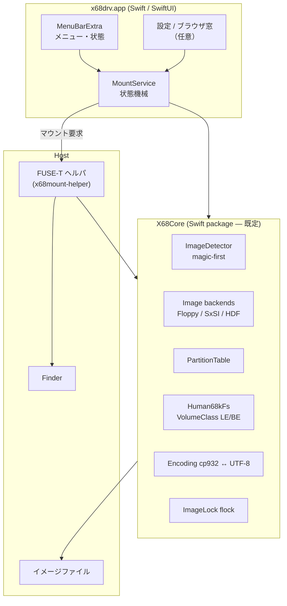
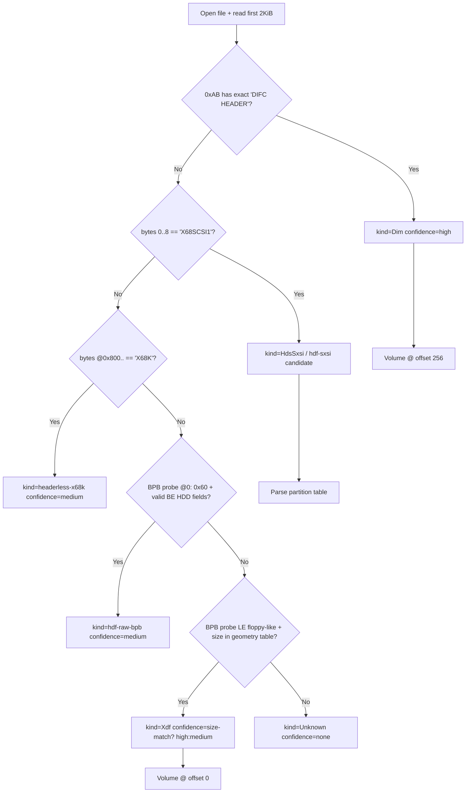
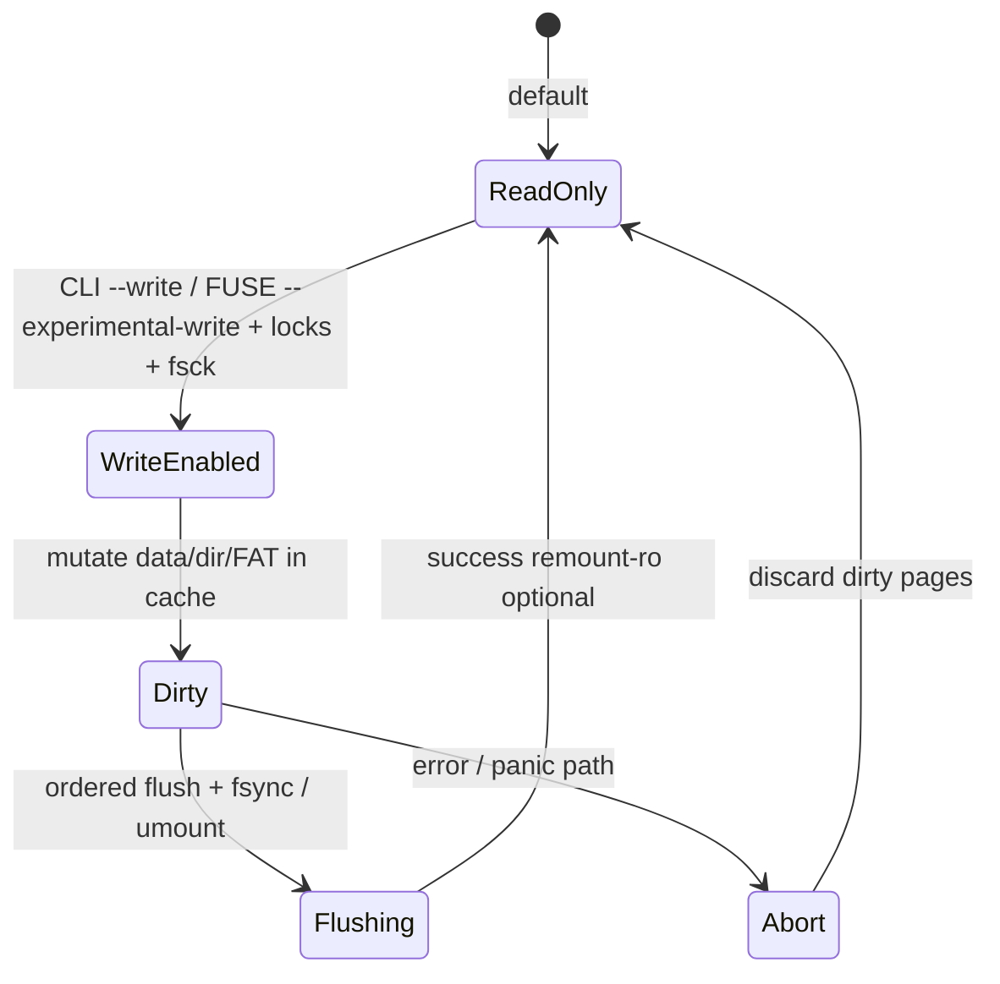
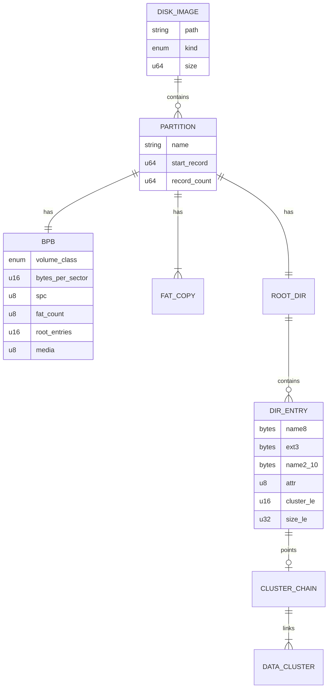
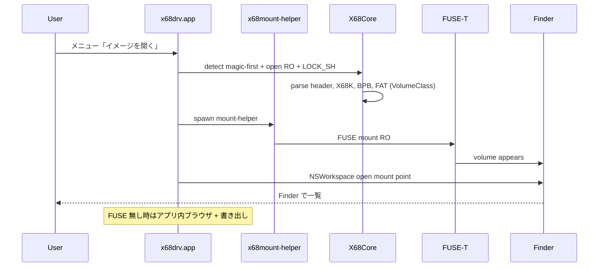

# x68drv: macOS 向け X68000 ディスクイメージマウント設計書

| 項目 | 内容 |
|------|------|
| 文書名 | x68drv Design Document |
| 著者 | （リポジトリオーナー） |
| 日付 | 2026-07-18 |
| 改訂 | 2026-07-18 Rev.5.4（design.md を docs/ へ） |
| 状態 | **Accepted for menu-bar RO-first** |
| リポジトリ | `/Users/ring2/Documents/src/x68drv` |
| 対象 OS | macOS 13+ 推奨（MenuBarExtra）。下限は macOS 12 検討可。Apple Silicon / Intel |

---

## Overview

X68000 エミュレータで用いるディスクイメージ（`.hdf` / `.hds` / `.xdf`）を、エミュレータなしで macOS から使えるようにする **メニューバー常駐アプリ** **x68drv** を設計する。

**最終ゴール（製品）** はターミナル専用ツールではない。

1. `/Applications` に `x68drv.app` を入れる  
2. **ダブルクリックで起動**（Dock に常駐しない設定も可）  
3. **メニューバーにアイコン**が出て、開く / マウント解除 / 最近使ったイメージ / 設定 を操作する  
4. マウントした内容は **Finder** で触る（読取専用先行）

フォーマット解釈（Human68k LE/BE、SxSI パーティション等）の調査結果は Rev.4 までと同様。**製品の一次 UI は Swift メニューバーアプリ**とし、CLI は開発・デバッグ・自動化用の副産物とする。

**Rev.5 の要点（ユーザー決定 2026-07-18）**: 最終形は **Application フォルダのメニューバーアプリ**。言語は **Swift 第一**（Rust 一本は不採用）。RO + extract / mount 先行。ライセンス MIT。HDF は実サンプル + `xm6_206s`。

**Rev.5.1–5.2**: `xm6_206s` / `MPX68K` は参照専用。入口マップと `disk/` 実測を **docs/** に記録（下記）。

### 関連ドキュメント（調査の正本）

| 文書 | 内容 |
|------|------|
| [`README.md`](README.md) | ドキュメント索引 |
| [`format-entry-points.md`](format-entry-points.md) | XM6/MPX68K の形式別 **入口関数**（移植禁止） |
| [`disk-samples-verification.md`](disk-samples-verification.md) | 手元 `disk/` の **サイズ・マジック・BPB 実測** |

---

## Background & Motivation

### 現状の痛点

1. **エミュレータ起動コスト**  
   ファイル 1 つを入れ替えるだけでもエミュレータ起動 → ディスクイメージ接続 → ホスト側へコピー、という手順が必要。
2. **macOS 向けツールの欠如**  
   デファクトの DiskExplorer は Windows 向け。Linux/Unix には `fathuman` / `dis68k`（フロッピー中心・読取中心）や `erique/scsitools`（HDS 向け Python）があるが、**macOS でマウントする体験**は提供されない。
3. **フォーマットの非標準性**  
   Human68k のファイルシステムは MS-DOS FAT と「似て非なる」。特に:
   - **フロッピー（XDF/DIM）**: おおむね MS-DOS 互換の **little-endian BPB + FAT12**（1024 バイト/セクタ、18.3 名、Shift_JIS）
   - **HDD（HDS/SxSI パーティション）**: Sharp 系の **big-endian BPB + big-endian FAT16**、セクタ/record 1024 バイト、メディア記述子 0xF7  
   このため macOS の `hdiutil` や汎用 FAT ドライバでは両方を正しく扱えない。
4. **マルチパーティション HDD**  
   SASI/SCSI イメージは最大 15 パーティション程度を持ち得る。パーティション選択 UX が必須。
5. **書込ツールの破壊事例**  
   コミュニティでは DiskExplorer 等によるイメージ破損の注意が共有されている。**当面 x68drv は書込を実装しない**が、将来書込を入れる場合は既定 OFF + preflight を厳しくする（後述の将来設計を参照）。
6. **利用可能な一次資料（ユーザー環境・リポジトリ外）**  
   - 実機/エミュ由来の **実ディスクイメージ**（ローカル `disk/` — `.gitignore`。研究スパイク・ゴールデン候補）  
   - **XM6 2.06 ソース**（ローカル参照ツリー。リポジトリには含めない）— SASI/HDF 等のイメージ I/O・構造の参照  
   - **MPX68K ソース**（同上）— px68k ベースの macOS アプリ。イメージ/フロッピー周り構造の参照  

   > **参照専用ポリシー**: XM6 / MPX68K は **ディスクイメージのフォーマット・レイアウト・I/O 仕様を解析するためだけ**に使う。  
   > **コードの移植・コピー・ライセンス混入を目的としない。** 実装は Swift の自前コード（X68Core）で行い、参照実装から得た知見は仕様・テスト・コメントに落とす。  
   > 解析メモの正本は [docs 索引](README.md)。参照ツリー本体は git 管理外。

### 現在の転送手段（先行事例）

| 手段 | 特徴 | 制約 |
|------|------|------|
| DiskExplorer | GUI で HDS/HDF/XDF 等を直接編集 | Windows 中心。破損報告あり |
| エミュレータ内ホスト FS | 実行時にホストと共有 | エミュレータ必須 |
| `fathuman` / `dis68k` | XDF/DIM の list/extract | 書込・HDD 弱 |
| `erique/scsitools` | HDS の pack/unpack/fsck/add | CLI のみ、Python |
| Aaru (DiscImageChef) | パーティション検出の一部対応 | 2018 時点で Human68k HDD BPB 識別に課題があった経緯（[issue #173](https://github.com/aaru-dps/Aaru/issues/173)、当時 closed。**現行 Aaru の完成度は本設計では再検証しない**） |

---

## Goals & Non-Goals

### Goals

| ID | 内容 | 出荷ゲート |
|----|------|------------|
| G-XDF | **1232KB 2HD** の `.xdf` および `.dim` の **読取 / extract** | **v0.1 必須** |
| G-HDS | `.hds`（SCSI / SxSI）の **読取・パーティション列挙 / extract** | **v0.1 必須** |
| G-HDF-a | `.hdf`（SASI）の **レイアウトクラス検出と診断レポート** | v0.1（マウント成功は要求しない） |
| G-HDF-b | 検証済みクラスの `.hdf` のみ **mount/extract 成功** | 実サンプル + XM6 ソース照合後、ゴールデン達成クラスから段階解放 |
| G-FS | Human68k FS の正しい **読取**解釈（媒体クラス別 endian、18.3 名、Shift_JIS ⇔ UTF-8） | v0.1 |
| G-APP | **`x68drv.app` メニューバー常駐**（ダブルクリック起動、ログイン時起動オプション） | **v0.1 必須** |
| G-UX | メニューからイメージを開く / ドラッグ&ドロップ / マウント解除 / 「Finder で表示」 / 最近使った項目 | **v0.1 必須** |
| G-FUSE | macOS 上 **読取専用** マウント（FUSE-T 優先）。Finder で一覧・コピーアウト | **v0.1 RO のみ** |
| G-BROWSE | FUSE 未導入時の **アプリ内ブラウザ + ホストへ書き出し**（フォールバック） | v0.1 推奨（FUSE 依存を必須にしないため） |
| G-CLI | （任意）開発用 CLI / テストハーネス。**製品の主経路ではない** | テストに必要なら v0.1 内部利用 |
| G-TEST | ゴールデン + scsitools/fathuman オラクル（CI） | 継続 |
| G-WRITE | （**将来**）イメージへの書込 | **0.1 非対象** |

### Non-Goals（初期スコープ外） / 当面のスコープ境界

- **ターミナルを主 UI にした製品**（CLI は副次。README の主説明は .app）
- **当面の書込**（マウント RO + extract / 書き出しのみ）
- カーネル拡張（kext）
- Windows / Linux 公式パッケージ
- D88 / FDI 等の複雑コピープロテクト
- **v0.1 の非 1232KB フロッピー** の完全サポート
- エミュレータ本体・実機 SASI/SCSI
- 出荷への Python/scsitools 同梱
- 本格ディスクユーティリティ GUI（パーティション編集・低レベルフォーマット）
- **`xm6_206s` / `MPX68K` からのコード移植**（参照・解析のみ。x68drv 本体への取り込み禁止）

---

## 調査結果サマリ（フォーマット仕様）

> 以下は公開リポジトリ・ツール実装・コミュニティ資料に基づく。推測箇所は **【仮定】** と明記する。

### 1. XDF フロッピーイメージ

| 項目 | 内容 |
|------|------|
| 性質 | **ヘッダなし raw セクタダンプ** |
| **v0.1 サポートサイズ** | **1,261,568 バイト（1232 KB）** = 2HD のみを成功パスとする |
| ジオメトリ（2HD） | 77 トラック × 2 面 × 8 セクタ × **1024 バイト/セクタ** |
| FS | Human68k **FAT12 / little-endian**（MS-DOS 互換 BPB レイアウト。`fathuman`+FatFS が実証） |
| ブートセクタ | 先頭付近に `X68IPL` 系文字列が現れることが多い（検出の **ヒント**、必須ではない） |
| メディア記述子 | フロッピーでは **0xFE**（2HD 系）が典型。検出の補助に使うが単独判定には使わない |
| **手元実測** (`disk/`) | 3 本すべて 1,261,568。Disk2/OSR2 は LE BPB 正常（bps=1024, media=0xFE, root@0x1400）。Disk1 は Hudson ブートで BPB@0x0B 異常だが **同一ルート位置にディレクトリ痕跡** → **BPB 失敗時は 2HD 既定ジオメトリへフォールバック**を推奨。詳細: [`disk-samples-verification.md`](disk-samples-verification.md) §3 |

**関連フォーマット**

| 拡張子 | 概要 | v0.1 |
|--------|------|------|
| `.dim` | 先頭 **厳密に 256 バイト**ヘッダ。オフセット **`0xAB` から 11 バイト**が `"DIFC HEADER"`。以降は XDF 相当セクタ列。`fathuman` は一致時 `offset=256` | サポート |
| `.hdm` 等 | raw 2HD の別名として流通することがある | サイズ+BPB で XDF 相当として試行可 |
| `.d88` | 可変長セクタ記述 | Non-Goal |
| その他サイズ XDF | 2DD / 1.4MB 等 | 検出ヒントのみ。成功マウントは Phase 後 |

参考: [vampirefrog/fathuman](https://github.com/vampirefrog/fathuman)、[waybeforenow/dis68k](https://github.com/waybeforenow/dis68k)

### 2. HDS（SCSI / SxSI）ハードディスクイメージ

`erique/scsitools` の実装（特に README の Disk Layout、`scsiformat.py`、`fsck.py` の `info`/`check_scsi_header`/`parse_partition_table`/`parse_bpb`）を **規範的参照** とする。

#### 規範: Record addressing

```text
【Record addressing — scsitools fsck.py 準拠の解釈】

内部の正規単位:
  LOGICAL_RECORD = 1024 bytes   # scsiformat.RECORD_SIZE
  HOST_SECTOR    = 512 bytes    # fsck が raw read に使う単位

バイトオフセット（固定・イメージ先頭から）:
  SCSI header     = 0x0000
  IPL             = 0x0400      # = 1 * 1024
  Partition table = 0x0800      # = 2 * 1024  （fsck は 512B 換算で sector 4）
  Driver area     = 0x0C00
  Partition 0     = 0x8000      # = 32 * 1024 が典型（パーティション表の start を優先）

ヘッダ解析アルゴリズム（check_scsi_header 相当）:
  1. buf[0..8) == b"X68SCSI1" でなければ SCSI ヘッダ無しとみなし 0 を返す（警告）
  2. bytes_per_record = BE16 @ 0x08
       scsiformat はここへ 0x0200 (512) を書く。LOGICAL_RECORD はそれでも 1024。
  3. disk_end_record = BE32 @ 0x0A + 1
  4. sxsi = (buf[0x2A..0x2E) == b"SxSI")
       ※ 0x2A は説明文字列内の部分一致（"This SCSI-UNIT format is 'SxSI' ..."）。
       ※ scsiformat が書く説明文に "SxSI" が含まれるため、生成イメージでは true になり得る。
       ※ sxsi == true のとき fsck は: disk_end_record <<= 1
  5. total_512_sectors = disk_end_record * (bytes_per_record // 512)
  6. パーティション表の start/count は「record 単位（1024B 系）」で格納され、
     fsck は start_sector_512 = BE32(start) * 2  のように *2 して 512B LBA に変換する。

実装方針（x68drv）:
  - ディスク上の全オフセット計算は **1024 バイト record を正規座標** とする。
  - 512 変換は scsitools 互換検証時と、bytes_per_record フィールドの解釈時のみ行う。
  - flags @ 0x0E は scsiformat が 0x0100 を書くが、**現状セマンティクス未定義** → 保存のみ、分岐に使わない。
  - `"SxSI"` @ 0x2A は **診断表示 + fsck 互換の end_record 補正**に使う。曖昧な「×2 スイッチ」と書かず、上記アルゴリズムをコードとテストで固定する。
  - ゴールデン: scsitools `scsiformat.py` で生成したイメージを HDS vector とする。HDF は XM6 ソース + 実イメージで別途。
```

#### ディスク先頭レイアウト（バイトオフセット）

```
Offset 0x0000  (record 0)     SCSI ヘッダ ("X68SCSI1")
Offset 0x0400  (record 1)     IPL ブートコード
Offset 0x0800  (record 2)     パーティション表 ("X68K")
Offset 0x0C00  (records 3+)   デバイスドライバ領域
Offset 0x8000  (record 32)    パーティション 0 本体（典型・表の start を優先）
```

#### SCSI ヘッダ（record 0）

| オフセット | 型 | 内容 |
|------------|-----|------|
| +0x00 | 8B | シグネチャ `"X68SCSI1"` |
| +0x08 | BE16 | bytes per record フィールド（scsiformat は `0x0200`） |
| +0x0A | BE32 | 最終 record 番号（total_records − 1） |
| +0x0E | BE16 | flags（`0x0100` を書く実装あり・意味は未定義扱い） |
| +0x10 | 文字列 | 説明文 |
| +0x2A | 4B | 説明文中の `"SxSI"` 部分（上記アルゴリズム参照） |

#### パーティション表（offset 0x800）

| オフセット | 型 | 内容 |
|------------|-----|------|
| +0x00 | 4B | `"X68K"` |
| +0x04 | BE32 | 最終パーティション終端関連 |
| +0x08 / +0x0C | BE32 | ディスク最終 record 関連 |
| +0x10 + i×16 | 構造体 | パーティションエントリ（実装上限 **15**） |

**パーティションエントリ（16 バイト）**

| オフセット | 型 | 内容 |
|------------|-----|------|
| +0 | 8B | 名前（例: `"Human68k"`） |
| +8 | BE32 | 開始 record（1024B 座標） |
| +12 | BE32 | record 数 |

#### パーティション内 BPB（Human68k HDD — big-endian）

MS-DOS BPB と **互換ではない**。`scsiformat.py` `write_boot_sector` / `fsck.py` `parse_bpb` 準拠:

| オフセット | 型 | 内容 |
|------------|-----|------|
| +0x00 | 1B | `0x60`（68000 BRA。識別に利用） |
| +0x12 | BE16 | bytes per sector（**1024**） |
| +0x14 | 1B | records per cluster (SPC) |
| +0x15 | 1B | FAT 数（通常 2） |
| +0x16 | BE16 | reserved records |
| +0x18 | BE16 | ルートディレクトリエントリ数 |
| +0x1C | 1B | メディア記述子（HDD で **0xF7**） |
| +0x1D | 1B | FAT 1 本あたりの record 数 |
| +0x1E | BE32 | パーティション record 数 |
| +0x22 | BE32 | パーティション開始 record |

容量目安: コミュニティでは HDS が **約 4GB まで**と語られることが多い。これは **当時のツール/エミュレータのソフト上限**であり、フォーマット上の絶対上限ではない（FAT16+SPC で理論上それ以上も構成可能）。x68drv はリソース上限（後述）で防護する。

参考: [erique/scsitools](https://github.com/erique/scsitools)、[Aaru issue #173](https://github.com/aaru-dps/Aaru/issues/173)

**手元実測** (`disk/System.HDS`, 200MB): magic `X68SCSI1`、BE16@+8=512、`X68K`@0x800、`Human68k` start=32 → boot@**0x8000**、BPB media **0xF7** / bps BE 1024 / spc 4。上記 scsitools モデルと一致。詳細: [`disk-samples-verification.md`](disk-samples-verification.md) §5。

### 3. HDF（SASI）ハードディスクイメージ

| 項目 | 調査結果 |
|------|----------|
| 用途 | XM6 等の **SASI** 固定ディスクイメージ |
| XM6 open | `SASIHD::Open`: サイズ **10/20/40MB のみ**（`0x9f5400` / `0x13c9800` / `0x2793000`）、物理セクタ **256B**（`size>>8`） |
| MPX68K | バッファ全体を 256B セクタ数として扱う（固定 3 サイズ制限なし） |
| DiskExplorer | 「Human 68k HDD」と「Human 68k HDD SCSI」を区別して開く |
| レイアウト | 単一の業界標準仕様は無いが、**手元 + XM6 で 1 クラスを確定**（下記） |

#### 検証済みクラス（2026-07-18 · 手元 `HD.hdf` / `HD2.hdf`）

| クラス ID | 内容 | マウント |
|-----------|------|---------|
| **`hdf-sasi-x68k-256`** | ヘッダ無し。物理 **256B**。`X68K` @ **0x400**（LBA4×256）。`Human68k` start は **物理 LBA**（×256 で boot）。FS は BE BPB（boot+0x12 に bps=1024）。XM6 40MB サイズと一致するサンプル 2 本 | **G-HDF-b 第一候補**（extract/mount 可にする） |
| `hdf-unknown` | 上記以外 | **検出レポートのみ** |

#### 未検証クラス（残仮説）

| クラス ID | 仮説 | 状態 |
|-----------|------|------|
| `hdf-sxsi` | `X68SCSI1` を持つ SASI 名義ファイル | 手元に無し |
| `hdf-raw-bpb` | 先頭が即 Human68k BE ブートのみ | 手元に無し |
| 非 10/20/40MB SASI | MPX68K は開けるが XM6 は拒否 | 未検証 |

**記録の正本**: [`disk-samples-verification.md`](disk-samples-verification.md) §4、入口: [`format-entry-points.md`](format-entry-points.md)。

**研究スパイク（継続）**:

1. 他サイズ HDF・他クラスの有無を実サンプルで表にする（市販コンテンツはリポジトリに置かない）
2. XM6 / MPX68K は **参照専用**（移植禁止）
3. 強制 `--format` は読取用。書込は当面無し

### 4. Human68k ファイルシステム

#### Endianness by media class（規範）

| 媒体クラス | 判定トリガ | BPB フィールド | FAT 幅 | FAT エントリ endian | ディレクトリ time/date | cluster / size |
|------------|------------|----------------|--------|---------------------|------------------------|----------------|
| **Floppy**（XDF/DIM） | イメージ種別 = Xdf/Dim、または単一 LE ボリューム | **LE**（MS-DOS 互換オフセット） | **FAT12** | **LE** | **LE**（DOS 互換）※実装は fathuman/FatFS 準拠で検証 | **LE** |
| **HDD volume**（HDS/SxSI パーティション、および BE 系 HDF） | パーティション上 BPB、`0x60` 先頭 + media `0xF7` + bps=1024 BE | **BE**（§2 表） | **FAT16**（既定） | **BE** | **BE** | **LE**（混合） |

> **重要**: 「Human68k = 常に BE BPB」は誤り。**HDD パーティションが BE、フロッピーは LE** が先行実装（fathuman vs scsitools）と整合する。

##### `Human68kFs::open` のモード選択

```text
1. 呼び出し元が ImageKind / VolumeClass を渡す（検出器の結果）。
2. VolumeClass::FloppyLeFat12
     → BPB を LE として読む。FAT12。override 無し。
3. VolumeClass::HddBeFat16
     → BPB を BE として読む（§2）。FAT を BE16 で読む。
4. クラスタ数・FAT サイズから妥当性チェック:
     - clusters < 4085 かつ Floppy → FAT12 確定寄り
     - HDD で FAT テーブルが 12bit 解釈の方が一貫する場合のみ警告
5. 手動 override（scsitools 互換）:
     --fat-width 12|16
     --fat-endian be|le
     --bpb-endian be|le
6. 不一致時は OpenError::AmbiguousFat を返し、info に両解釈を出す。
```

ゴールデンテスト行列: (XDF LE FAT12) × (HDS BE FAT16) × (override 強制) を必須とする。

#### ディレクトリエントリ（32 バイト）

**HDD（scsitools）および書込パスの規範**（フロッピーは FatFS 互換レイアウトで検証し差分があれば表に追記）:

| オフセット | サイズ | エンディアン | 内容 |
|------------|--------|--------------|------|
| 0x00 | 8 | — | ファイル名（空白パディング）。削除マーク 0xE5。先頭が 0xE5 の実名は 0x05 で格納 |
| 0x08 | 3 | — | 拡張子 |
| 0x0B | 1 | — | 属性（RO=0x01, HID=0x02, SYS=0x04, VOL=0x08, DIR=0x10, ARC=0x20） |
| 0x0C | 10 | — | **fileName2**（名前本体の 9〜18 バイト目。計 18 + 拡張子 3） |
| 0x16 | 2 | **BE（HDD）** | DOS 時刻 |
| 0x18 | 2 | **BE（HDD）** | DOS 日付 |
| 0x1A | 2 | **LE** | 開始クラスタ |
| 0x1C | 4 | **LE** | ファイルサイズ |

- ファイル名エンコーディング: **Shift_JIS（cp932）**
- 長い名前: VFAT LFN（属性 0x0F）ではなく **fileName2**
- ボリュームラベル: attr `0x08`。`readdir` では **既定で隠す**。`xattr com.x68drv.volume_label` または `info` で表示

##### ファイル名パッキング規範（inject 時 — scsitools `parse_human68k_filename` 相当）

1. UTF-8 → cp932。失敗したら書込拒否（置換オプション明示時のみ `?` 等）
2. 最後の `.` で name / ext 分割（name 空はエラー）
3. name は最大 18 **SJIS バイト**、ext 最大 3。超過はエラー
4. **DBCS 境界**: name を 8 バイト枠に入れるとき、**第 8 バイトが SJIS リードバイトで終わらない**ようにする。リードバイトで切れる場合は 7 バイトで打ち切り残りを fileName2 へ（実装は scsitools と同様にバイト列操作し、テストで `表` など 2 バイト文字を境界に置く）
5. name[0..8) 空白パディング、name2 は余剰 + NUL パディング、ext 空白パディング
6. 先頭バイト 0xE5 → 0x05 に置換して格納
7. **大文字化**: scsitools の add パスは ASCII `a-z` を upper する実装あり。x68drv は **書込時 ASCII のみ upper**、読取は **case-preserving 表示 + lookup は ASCII 範囲のみ case-fold**（A-Z/a-z）。全角の case-fold はしない
8. 比較: name8+name2+ext のパディング込みバイト列を、ASCII 範囲のみ upper して比較
9. 末尾空白・末尾ドット: ホスト名から除去してからエンコード。ディスク上の空白パディングは表示時 strip

##### ルートサイズ検証

`root_entries * 32 <= root_dir_records * bytes_per_sector` を open 時に検証。超過・ゼロは `FormatError`。

#### ボリューム構造（パーティション内 / フロッピー）

```
[Boot sector / BPB] → [FAT #1] → [FAT #2] → [Root directory] → [Data clusters]
```

クラスタ 2 からデータ開始。

---

## Proposed Design

### 製品 UX（最終ゴール）

```text
/Applications/x68drv.app
        │  ダブルクリック
        ▼
  メニューバーアイコン（常駐）
        │
        ├─ イメージを開く…          → ファイルピッカー / ドロップ
        ├─ 最近使ったイメージ
        ├─ マウント中: game.hds ▶
        │     ├─ Finder で表示
        │     ├─ パーティション切り替え（HDD）
        │     └─ アンマウント
        ├─ 設定…（ログイン時起動、マウント先、FUSE 診断）
        └─ 終了
```

- **Dock 非表示**（`LSUIElement` / メニューバー専用）を既定候補。設定で Dock 表示も可。  
- イメージを **Dock アイコン or メニューへ D&D** で開ける。  
- マウント成功後は **Finder を前面に**（マウントポイントを `NSWorkspace` で open）。  
- FUSE-T 未導入時はアラート + **アプリ内ブラウザ**へフォールバック（一覧・選択書き出し）。「ターミナルを開け」は出さない。

### アーキテクチャ概要



### レイヤ責務

| レイヤ | 責務 | 技術 |
|--------|------|------|
| **x68drv.app** | メニューバー UI、通知、設定、ログイン項目、D&D、Finder 連携 | SwiftUI `MenuBarExtra` + AppKit 必要箇所 |
| **X68Core** | 検出、パーティション、Human68k FS 読取、エンコード、ロック | **Swift Package**（既定）。バイナリ安全のため境界検査を徹底 |
| **x68mount-helper** | FUSE コールバック（別プロセス推奨） | Swift/C で libfuse 互換 API、または薄いヘルパ。**アプリから spawn** |
| **開発用 CLI**（任意） | 回帰テスト・オラクル比較 | `swift test` または小さな `x68drv-tool`。製品配布に含めなくてよい |
| **テスト** | 合成ゴールデン、オラクル | XCTest; scsitools/fathuman は CI subprocess |

**Rust について**: 最終製品がメニューバー .app であるため **Rust 一本は不採用**。パーサを Rust にする「FFI ハイブリッド」は将来オプション（後述 Alternatives）であり、v0.1 では **Swift 単一言語**で速度を優先する。

### イメージ検出アルゴリズム（magic-first）

サイズは **ヒント**であり、第一分岐にしない。



**構造化検出結果**（`x68drv info --json` / `info --detect-only`）:

```json
{
  "path": "disk.hds",
  "kind": "hds_sxsi",
  "confidence": "high",
  "evidence": ["magic:X68SCSI1@0", "magic:X68K@0x800"],
  "size": 33554432,
  "partitions": [{"index": 0, "name": "Human68k", "start_record": 32, "record_count": 32735}],
  "warnings": []
}
```

**フロッピー ジオメトリ表（ヒント）**

| ラベル | サイズ (bytes) | v0.1 マウント |
|--------|----------------|---------------|
| 2HD 1232K | 1,261,568 | **Yes** |
| 2HD 1248K 等 | 表に追加予定 | No（検出のみ） |
| 2DD | 表に追加予定 | No |
| その他 | — | No |

### マルチパーティションのマウント UX（確定）

**既定: パーティション 0 のみをボリュームルートに公開する。**  
他パーティションがある場合、stderr / マウント直後の `.x68drv_partitions` 仮想ファイル（または起動時 1 行ヒント）で一覧を示し、`--all` を案内する。

```text
# 一覧
$ x68drv info game.hds
Partitions:
  [0] Human68k  start=32  size=30.0MiB
  [1] DATA      start=... size=...

# 既定 = partition 0（ルートがそのまま FS）
$ x68mount game.hds /Volumes/x68

# 明示
$ x68mount -p 1 game.hds /Volumes/x68-data

# 全パーティション（明示オプトイン）
$ x68mount --all game.hds /Volumes/x68
# → /Volumes/x68/0_Human68k/...
# → /Volumes/x68/1_DATA/...
```

フロッピーは単一ボリューム。

#### パス文法（統一）

ホストパスとイメージ内パスの混同を避けるため、**イメージ内パスに `image:path` コロン記法を使わない**。

| 用途 | 文法 |
|------|------|
| パーティション | 常に `-p N` または `-p name`（CLI/mount 共通） |
| イメージ内パス | 別引数の POSIX 風文字列 `/dir/file`（内部で `HumanPath` にパース。`\` も区切りとして受理） |
| extract 例 | `x68drv extract -p 0 disk.hds ./out` または下記 `cp` 規則 |
| inject 例 | （**将来**）`x68drv inject --write -p 0 disk.hds ./local.bin /GAME/LOCAL.BIN` — 当面未実装 |

### エンコーディング方針

| 方向 | 挙動 |
|------|------|
| ディスク → macOS | cp932 → UTF-8。デコード不能は既定 **パーセントエスケープ**（`--name-fallback replace` で U+FFFD） |
| macOS → ディスク | UTF-8 → cp932。変換不能は **書込拒否**（既定） |
| 正規化 | lookup 前に **NFC**。FUSE-T 経路での追加正規化差は既知リスクとして doctor で案内 |
| 大文字小文字 | ASCII のみ case-insensitive lookup |

### 読取専用 vs 書込（write-back + ordered flush）

> **【当面の実装方針（Rev.4 / ユーザー決定）】**  
> **v0.1 および近接リリースでは書込パスを実装しない。** 提供するのはメニューバー UI・RO マウント（任意）・アプリ内ブラウザ / ホストへの書き出しのみ。  
> 以下の write-back / コミット順序 / Phase 3 要件は **将来実装時に再設計しなくてよいよう残した仕様メモ**であり、0.1 の完了条件ではない。

**「journaling」という語は用いない。** 将来実装する際の実態は write-back キャッシュと **定義されたコミット順序** による best-effort 一貫性である。クラッシュ時の完全 ACID は保証しない。



#### コミット順序（規範）

操作種別ごとに順序が異なる。**create/inject でディレクトリを FAT より先に永続化してはならない**（エントリが free クラスタを指す窓を作るため）。

##### create / inject（新ファイル）

```text
0. 空きクラスタをメモリ上で予約（まだディスク FAT は更新しない）
1. データクラスタ本体をイメージへ write
2. FAT コピー #1 を write（割当チェーンを公開）
3. FAT コピー #2 を write
4. ディレクトリエントリを write（この時点でファイルが可視）
5. fsync(イメージ fd)
```

| クラッシュ時点 | 結果 | 回復 |
|----------------|------|------|
| 1 の途中〜2 前 | 未リンク領域にゴミ。FAT/dir 未更新 | 空きのまま。上書き可 |
| 2 完了〜3 前 | FAT1 のみ割当、dir 無し | lost clusters → fsck で回収可。ユーザ可視ファイルは無し |
| 3 完了〜4 前 | 両 FAT 割当済み、dir 無し | 同上（lost）。**半端な「読める壊れたファイル」は出ない** |
| 4 完了〜5 前 | 論理整合、永続化未完了の可能性 | fsync 必須。バックアップから戻すのが安全 |

##### delete / rm

```text
1. ディレクトリエントリを削除マーク (0xE5) で write（名前が先に消える）
2. FAT チェーンを free に更新（#1 次いで #2）
3. fsync
```

クラッシュで lost が残っても、**幽霊名で読める**窓は作らない。

##### rename（同一ボリューム）

```text
1. 新ディレクトリエントリを write（または同一スロットの名前フィールド更新）
2. 旧スロットを消す必要がある場合のみ 0xE5（同一スロット更新なら不要）
3. fsync
```

データ/FAT は動かさない。中間状態でもクラスタ所有は常にどちらか一方の名前に紐づくよう実装する（同一スロット更新を優先）。

##### mkdir

create と同様: ディレクトリ初期クラスタ data → FAT#1 → FAT#2 → 親 dirent → fsync。

#### Phase 3（FUSE 書込）の安全レベル — 決定

| レベル | 内容 | 採用 |
|--------|------|------|
| (a) 更新のたびフルイメージ temp + atomic rename | 最も安全、巨大 HDS で高コスト | オプション `--commit=atomic-image` |
| (b) COW サイドファイル | 複雑 | 将来 |
| (c) best-effort + **必須 pre-backup** | 既定 | **採用** |

**Phase 3 既定要件**:

1. **`x68mount --experimental-write` 明示**（0.3 安定後は `--write` をエイリアスとして追加。CLI の `--write` とは別系統のフラグ面を維持しつつ、0.3 以降は両コマンドで `--write` を受け付ける）
2. 排他 `flock`
3. open 時 **fsck clean**（失敗時は拒否。`--force-dirty` で上書き可）
4. 既定でバックアップ作成: APFS なら `clonefile(2)` / `cp -c` 相当を試し、ダメならフルコピー。`--no-backup` は二重確認
5. Finder の「一時ファイル + rename」: Human68k 上では **最終名での create + write + 同一ディレクトリ内 rename をサポート**（rename は **PR-14c**）。不完全な `.` で始まる一時名は通常ファイルとして残る可能性をドキュメント化（原子性チェックリストは **PR-15**）

### ロックポリシー

| モード | ロック | 失敗時 |
|--------|--------|--------|
| RO オープン | **共有** `flock(LOCK_SH)` | 他が排他保持 → エラー（PID が取れれば表示） |
| 書込オープン（CLI `--write` / FUSE `--experimental-write`） | **排他** `LOCK_EX` | ハードフェイル |
| ロック取得不可 | — | 終了コード 4。`--force-unlock` は **非推奨・警告付き**でロック検査をスキップ（破損責任はユーザ） |

エミュレータが flock しない場合は検知できない → ドキュメントで「イメージを使う前にエミュレータを終了」と明記（R6）。

### FUSE アダプタ契約

#### ビルド / リンク

| バックエンド | 導入 | リンク |
|--------------|------|--------|
| **FUSE-T（既定）** | `brew install macos-fuse-t/homebrew-cask/fuse-t` | `pkg-config` が fuse-t の libfuse を指すことを README に固定。`fuser` クレート |
| macFUSE（代替） | 公式 DMG / brew | 同一ソース。CI はどちらか一方でコンパイル確認 |
| FSKit（macOS 26+） | FUSE-T 経由の将来パス | 0.1 では非必須（KD-2） |

#### スレッド / 可変性

- **v0.1: シングルスレッド FUSE**（`fuser` の multi-thread を無効化、または大きな `Mutex<FsSession>` で全 op を直列化）
- `FsSession` が `Human68kFs` + `BlockCache` + オープンハンドル表を保持
- 書込 API は `&self` + 内部 `Mutex`（または session ロック）とし、ライブラリ公開面から「FUSE が `&mut` を持てない」問題を排除

#### Inode 割り当て

```text
st_ino = ((partition_id as u64) << 48) | ((entry_gen as u64) << 32) | (stable_id as u64)

stable_id:
  - ルート = 1
  - ファイル/ディレクトリ = 開始クラスタ番号（クラスタ 0 のルート配下エントリは
    dir_slot_index + 0x8000_0000 など衝突しない空間）
entry_gen:
  - 削除再利用で inode 再利用を避ける世代（書込 Phase でインクリメント。RO は 0）
```

- `st_nlink`: ディレクトリは 2 + サブディレクトリ数（概算で 2 固定でも可と明記し v0.1 は **2 固定**）、ファイルは 1
- `.` / `..`: FUSE が合成。ディスク上のドットエントリは readdir で出さない（ホストと同様）
- ボリュームラベル: readdir に出さない

#### Phase 1（RO）サポート / 非サポート

| サポート | 非サポート |
|----------|------------|
| getattr, lookup, readdir, open, read, release, statfs, init, destroy | write, create, mkdir, unlink, rename, setattr, chmod, chown, xattr 書込, mmap 書込, O_APPEND, truncate, link, symlink |
| 読取 xattr: `com.x68drv.attr`（任意） | FUSE `allow_other` 既定 OFF（root 以外） |

#### `--all` の構造

- **1 プロセス・1 FUSE マウント**
- ルートは仮想ディレクトリ。子は `0_Name` …
- 各子に **独立した `Human68kFs` インスタンス**（1 BPB = 1 Fs）

#### キャッシュ TTL

- RO: カーネルキャッシュ許容（attr/entry TTL = 1.0s 程度）
- RW: TTL = 0、または自己 write 後に invalidate

#### オープンハンドル上限

- プロセスあたり **1024**（超過は EMFILE）

### ブロックキャッシュ

- ページ: 1024 バイトまたは 1 クラスタ
- 読取: LRU + 1 クラスタ先読み
- 書込: write-back。flush 時は **コミット順序**に従う
- レイテンシ目標: ローカル SSD で中規模 `readdir` < 50ms

### リソース上限（Resource limits）

| 項目 | 上限（v0.1） | 超過時 |
|------|--------------|--------|
| イメージファイルサイズ | 8 GiB | open 拒否（`--force-size` で警告付き許可） |
| パーティション数 | 15 | 超過エントリ無視 |
| FAT 常駐メモリ | `min(実FAT, 64 MiB)` | 窓付き読取にフォールバック |
| 1 回の read で辿る FAT チェーン長 | `min(file_size/cluster+8, 1_000_000)` | EIO + ログ |
| readdir 1 コールあたりエントリ | 4096 返却後に続きはオフセット | — |
| root_entries 宣言 | ≤ 65536 かつ領域内 | FormatError |
| 同時オープンファイル | 1024 | EMFILE |

FAT メモリ見積: `fat_recs * 1024 * fat_count`（両コピーを持たず #1 のみ常駐が既定）。

---

## API / Interface Changes

> 以下は **v0.1 公開面のスケッチ**（illustrative → 実装 PR-02〜05 で `semver 0.x` として固定）。`0.x` は破壊的変更可。`1.0` で安定化。

### 型

```rust
/// イメージ内パス。ホストの std::path::Path は使わない。
pub struct HumanPath { /* components: Vec<HumanComponent> */ }
impl HumanPath {
    pub fn parse_user(s: &str) -> Result<Self, PathError>; // '/' と '\\'
    pub fn components(&self) -> &[HumanComponent];
}

pub enum ImageKind { Xdf, Dim, HdsSxsi, Hdf { class: HdfClass }, Unknown }
pub enum HdfClass { Sxsi, RawBpb, X68kOnly, Unknown }
pub enum VolumeClass { FloppyLeFat12, HddBeFat16 }

pub struct PartitionId(pub u8); // 0..14

pub struct DetectionReport {
    pub kind: ImageKind,
    pub confidence: Confidence,
    pub evidence: Vec<String>,
    pub partitions: Vec<PartitionInfo>,
    pub warnings: Vec<String>,
}

pub struct DiskImage { /* fd, kind, lock */ }
pub struct Volume { /* partition slice + Human68kFs */ }

pub struct OpenOptions {
    pub write: bool,
    pub partition: PartitionSelect, // Index(n) | Name(s) — All は DiskImage 側
    pub fat_override: FatOverride,
    pub require_fsck_clean: bool, // write 時 default true
}

pub enum X68Error {
    Format(FormatError),
    Fsck(FsckReport),
    Encoding(EncodingError),
    Io(std::io::Error),
    Lock(LockError),
    Unsupported(String),
    LimitExceeded(String),
}
```

### `Human68kFs`（概念）

```rust
impl Human68kFs {
    pub fn open(dev: Arc<dyn BlockDevice>, class: VolumeClass, opts: &OpenOptions)
        -> Result<Self, X68Error>;
    pub fn read_dir(&self, path: &HumanPath) -> Result<Vec<DirEntry>, X68Error>;
    pub fn open_file(&self, path: &HumanPath) -> Result<FileHandle, X68Error>;
    pub fn metadata(&self, path: &HumanPath) -> Result<Metadata, X68Error>;
    pub fn fsck(&self) -> Result<FsckReport, X68Error>;
    // Phase 2+ （&self + interior mutability）
    pub fn inject(&self, path: &HumanPath, data: &[u8]) -> Result<(), X68Error>;
    pub fn remove(&self, path: &HumanPath) -> Result<(), X68Error>;
    pub fn mkdir(&self, path: &HumanPath) -> Result<(), X68Error>;
    pub fn rename(&self, from: &HumanPath, to: &HumanPath) -> Result<(), X68Error>;
}
```

### CLI UX とフラグマトリクス

#### グローバルフラグ

| フラグ | 意味 | 安定版 |
|--------|------|--------|
| （既定） | 読取専用 | 常時 |
| `--write` / `-w` | **CLI 書込**（inject 等） | **当面未実装**（将来。実装後に安定化） |
| `--experimental-write` | **`x68mount` 書込** | **当面未実装**（将来） |
| `-o ro` / `-o rw` | mount ショートカット。当面 **`ro` のみ有効**。`rw` は未実装エラー | mount |
| `--no-backup` | 書込時バックアップ省略 | 将来 |
| `--force-dirty` | fsck 失敗でも書込 open | 将来 |
| `--force-unlock` | flock スキップ | 常時・非推奨 |
| `--fat-width` / `--fat-endian` / `--bpb-endian` | override | 常時 |
| `--format <class>` | 検出を無視して強制 | 常時 |
| `--json` | 機械可読（info 等） | 0.1 |
| `-p` / `--partition` | パーティション | 常時 |
| `--all` | 全パーティション（mount/extract） | 0.1 |
| `--name-fallback escape\|replace` | デコード不能名 | 0.1 |
| `--encoding cp932` | 将来拡張用（現既定 cp932） | 0.1 |

#### コマンド

```text
x68drv info     [--json] [--detect-only] <image>
x68drv ls       -p <N> <image> [human-path]
x68drv tree     -p <N> <image> [--depth N]
x68drv cat      -p <N> <image> <human-path>
x68drv cp       [options] <src> <dst>        # 下記「cp 方向規則」。v0.1 は extract 方向のみ
x68drv extract  -p <N>|--all <image> <outdir>
x68drv fsck     -p <N> <image>
x68drv doctor   [--mount-path <dir>]
x68drv mount    ...   # x68mount への薄いラッパでも可
# 以下は将来（当面 help で「未実装」）:
# x68drv inject --write ...

x68mount [options] <image> <mountpoint>   # 当面 -o ro のみ
```

#### `cp` 方向規則（`image:path` 廃止後）

v0.1 の第一級は **`extract`**（およびイメージ→ホストの `cp`）。**ホスト→イメージ（inject）は当面実装しない。**

```text
前提:
  - 引数はちょうど 2 つ（<src> <dst>）。複数 src は v0.1 非対応。
  - 「イメージファイル」= 既存ファイルかつ ImageDetector が Unknown 以外、
    または明示拡張子 .xdf/.dim/.hds/.hdf かつ --format 指定。

規則（v0.1）:
  1. src がイメージ、dst がホストパス → extract 相当。-p / -H を使用可。
     例: x68drv cp -p 0 disk.hds -H /GAME/FILE.X ./out
  2. dst がイメージ（inject 方向）→ **当面エラー**（「inject は将来。extract を使え」）。
  3. 両方イメージ / 両方ホスト / 曖昧 → 用法エラー。

将来 inject を入れるときは --write 必須 + 本文の書込設計に従う。
v0.1 で cp を省略し extract のみでも可。
```

#### 終了コード（コマンド対応）

| Code | 意味 | 返すコマンド例 |
|------|------|----------------|
| 0 | 成功 | すべて |
| 1 | 一般エラー（I/O、用法） | すべて |
| 2 | フォーマット非対応・破損・検出不能 | info, mount, ls, … |
| 3 | fsck が不整合を検出（check モード） | fsck; write open 前 preflight |
| 4 | ロック / 書込拒否 | write 系, mount --experimental-write |

### `x68mount --doctor` / `x68drv doctor`

1. FUSE-T または macFUSE のライブラリ検出  
2. サンプル loopback マウント試行（オプション）  
3. TCC「Network Volumes」注意の表示（FUSE-T）  
4. 指定イメージがあれば detect-only + partition 一覧  

---

## Data Model Changes

外部 DB なし。永続状態はディスクイメージファイル。

### オンディスク解釈モデル



### ホスト側メタデータ（任意）

`scsitools` 互換 `.x68k_meta`（extract 時）をサポート。

---

## Alternatives Considered

### A. マウント方式

| 方式 | 利点 | 欠点 | 判定 |
|------|------|------|------|
| **1. FUSE-T** | kext 不要、Homebrew、Apple Silicon | Network Volumes 権限、意味論差 | **推奨（既定）** |
| **2. macFUSE** | 実績 | kext / 配布困難。FSKit 化の途上 | 代替ビルド |
| **3. hdiutil + raw** | 標準のみ | FS 非対応 | **不採用** |
| **4. CLI のみ** | 依存最小 | 最終ゴールと不一致 | **副次（テスト用）** |
| **5. 9P/SMB エクスポート** | リモート | 過剰 | 将来 |
| **6. kext** | ネイティブ | SIP | **Non-Goal** |

### B. 実装言語

| 言語 | 判定 | 理由 |
|------|------|------|
| **Swift（SwiftUI + SPM）** | **採用（第一）** | メニューバー .app、公証、Sandbox/Entitlements、Finder 連携が本命。最終ゴールと一致 |
| Rust 一本 + 後から GUI | **不採用** | CLI/FUSE には強いが、メニューバー製品の主戦場ではない。二度手間 |
| Rust core + Swift UI（FFI） | **将来オプション** | パーサ安全性は魅力だが XCFramework・デバッグコスト大。v0.1 では不要 |
| Go / Python / C++ | **不採用** | .app 体験・配布・FUSE どれも劣る |

**方針**: v0.1 は **Swift 単一コードベース**。Human68k パーサも Swift で書く。安全性はユニットテスト・ファズ（必要なら）・境界付き読み取りで担保。

### C. FS 実装戦略

| 方式 | 判定 |
|------|------|
| **自前 Human68k FS** | **採用** |
| elm-chan FatFS 改変 | フロッピー交差検証の **参照実装としてテスト専用**に残し得る。core には埋め込まない（ライセンス/endian） |
| mtools | 不採用 |

---

## Security & Privacy Considerations

| 脅威 | 深刻度 | 対策 |
|------|--------|------|
| パーサ脆弱性 | High | Swift 境界検査、XCTest、必要なら libFuzzer |
| 書込によるデータ喪失 | High | RO 既定、backup、fsck、ordered flush |
| **悪意あるイメージのリソース枯渇** | High | Resource limits 表。RO でもチェーン長上限。巨大 root_entries / fat_recs で巨大確保しない |
| パストラバーサル | Medium | extract 時ホスト名サニタイズ |
| FUSE-T localhost NFS | Low–Med | ローカル信頼モデル。マウントポイント権限、`allow_other` 既定 OFF |
| 公証・Gatekeeper | Medium | リリースで公証 |
| プライバシー | Low | テレメトリなし |

**前提**: ディスクイメージは **非信頼入力**である。

---

## Observability

| 種別 | 内容 |
|------|------|
| ログ | `os_log` / 統一ログ。設定の「診断ログ」 |
| 診断 UI | FUSE 有無、TCC、Network Volume、最終エラー |
| メトリクス（開発） | readdir 遅延など（DEBUG ビルド） |
| クラッシュ報告 | なし（ローカルアプリ） |

---

## Rollout Plan

### 近接（0.1 まで — メニューバー RO-first）

1. **alpha**: Swift Package で XDF → HDS 読取 + XCTest。メニューバー枠（まだマウントなし）で「開く / 一覧 / 書き出し」  
2. **beta**: FUSE-T RO マウント + Finder で表示。FUSE 無し時はアプリ内ブラウザ  
3. **0.1.0**: `x68drv.app` を Applications に置いて使える。公証メモ。HDF は detect + 既知クラスのみ  

**0.1 完了の定義**: ダブルクリック → メニューバー → XDF/HDS を RO で Finder またはアプリ内から取り出せること。**ターミナル操作は不要。**

### バックログ（0.1 後）

4. G-HDF-b 拡大、Sparkle 更新、ログイン項目の洗練  
5. 将来書込（メニューから opt-in）— deferred  
6. （任意）Rust core 切り出し — 必要性を見てから  

ロールバック: .app 差し戻し。

---

## Key Decisions

| # | 決定 | 根拠 |
|---|------|------|
| KD-1 | **Swift 第一**で .app + Core を統一。**Rust 一本は不採用** | 最終ゴールがメニューバーアプリ（ユーザー決定 Rev.5） |
| KD-2 | **FUSE-T 第一**で Finder マウント。未導入時は **アプリ内ブラウザ** | 一般ユーザーに「brew install 必須」だけにしない |
| KD-3 | **UI 先（メニューバー）**。CLI は副次・テスト用 | 製品の主経路を誤らない |
| KD-4 | **既定 RO**。当面書込しない | 破損リスク・早期価値 |
| KD-5 | **Human68k FS を Swift で自前実装** | LE/BE 両対応。単一言語 |
| KD-6 | **HDS は scsitools を規範** | 実証済み |
| KD-7 | **HDF は G-HDF-a/b**、未知はマウントしない | 誤マウント防止 |
| KD-8 | **cp932 ⇔ UTF-8** | 相互運用 |
| KD-9 | **マウント既定 partition 0**。メニューで他パーティション選択 | Finder の筋記憶 |
| KD-10 | ライセンス **MIT のみ** | ユーザー決定 |
| KD-11 | 内部パスは `HumanPath`（コンポーネント列）。UI は POSIX 表示 | コロン記法は使わない |
| KD-12 | **VolumeClass 自動 + 設定で override** | scsitools 互換の逃げ道 |
| KD-13 | scsitools 一致は **テスト目標** | 過剰拘束を避ける |
| KD-14 | （将来書込）ordered write-back + backup。create は data→FAT→dir | 当面未実装 |
| KD-15 | 時刻は **ローカル TZ** | scsitools 同様 |
| KD-16 | 製品名 **`x68drv.app`**。ヘルパ `x68mount-helper`（バンドル内） | ユーザー向けは .app のみ |
| KD-17 | v0.1 フロッピーは **1232KB のみ** | スコープ |
| KD-18 | 出荷物に Python を含めない | メンテ境界 |
| KD-19 | **近接は RO-first メニューバー** | ユーザー決定 |
| KD-20 | 既定は **LSUIElement（Dock 非表示）** メニューバー専用 | 「アプリフォルダに入れて使う」常駐ツール |
| KD-21 | FUSE ヘルパは **別プロセス**（クラッシュ分離） | メイン UI を落とさない |

---

## Risks

| ID | リスク | 深刻度 | 緩和 |
|----|--------|--------|------|
| R1 | HDF 誤検出 | High | 未知は非マウント、ゴールデンゲート |
| R2 | 書込途中クラッシュ | High | ordered flush、backup、fsck、atomic-image オプション |
| R3 | FAT endian/幅誤認 | High | VolumeClass 表、ゴールデン、override |
| R4 | FUSE-T Network Volume で Finder 空 | Medium | アプリ内「診断」、**ブラウザ フォールバック**、導入リンク |
| R5 | Unicode 正規化差 | Medium | NFC + 注記 |
| R6 | エミュ同時オープン | Medium | flock（不完全）、メニュー警告 |
| R7 | 巨大 HDS メモリ | Low | FAT 64MiB キャップ |
| R8 | 公証 / Gatekeeper | Medium | Developer ID + 公証。FUSE は別途ユーザー導入になりやすい |
| R9 | FUSE を一般ユーザーが入れない | **High** | 0.1 から **アプリ内ブラウザ + 書き出し**を本線級に扱う |
| R10 | Sandbox と FUSE/ヘルパ | Medium | 当面 **非 Sandbox** または Helper に必要な entitlement を明示。Mac App Store は非目標 |

---

## Testing Strategy

### ゴールデン

- 自作のみ（著作権）。XDF/HDS は **Swift 合成** または CI で scsitools subprocess  
- 実機由来（`disk/` 配下など）はローカル検証用。市販ダンプを公開リポジトリに置かない  

### ピラミッド

1. XCTest ユニット: endian BPB 両系、FAT12/16、dir、SJIS  
2. 統合: export（イメージ→ホスト）  
3. オラクル CI: scsitools / fathuman  
4. UI: メニューバー操作の手動チェックリスト  
5. FUSE: macOS 手動（FUSE-T 導入マシン）  
6. エミュレータ手動チェックリスト  

### 合格基準

| 版 | 基準 |
|----|------|
| **0.1（現行ターゲット）** | ダブルクリックでメニューバー常駐; XDF/HDS を RO で Finder またはアプリ内から取り出し; 日本語名表示; FUSE 無しでも書き出し可; HDF unknown を誤マウントしない |
| **将来・書込（deferred）** | 0.1 の合格条件ではない |

---

## Open Questions

| ID | 内容 | 状態 |
|----|------|------|
| OQ1 | HDF 各クラスの実分布と必要ゴールデン | **部分解決**: 手元は **`hdf-sasi-x68k-256`**（40MB×2）を確定。他クラス・他サイズは Open。記録: `disk-samples-verification.md` |
| OQ2 | DiskExplorer HDD と SASI/SCSI 差 | **Open** — OQ1 の残りと同時。HDS 側は `System.HDS` で scsitools モデル確認済 |
| OQ3 | 非 1232K フロッピー | **Resolved for v0.1** |
| OQ4 | Finder 書込時 rename | **Deferred** |
| OQ5 | アプリ名 / バンドル ID | **Lean**: 表示名 `x68drv`、bundle `local.x68drv.app` 等は実装時確定 |
| OQ6 | ライセンス | **Resolved**: MIT |
| OQ7 | タイムゾーン | **Resolved**: ローカル |
| OQ8 | FUSE を v0.1 必須にするか | **Resolved lean**: **必須にしない**。Finder マウントは best-effort、ブラウザ FO 必須 |
| OQ9 | Mac App Store | **Resolved lean**: **出さない**（FUSE/ヘルパと相性）。直配布 + 公証 |

---

## PR Plan

各 PR は独立レビュー可能。製品の主線は **.app**。

### PR-01: リポジトリ骨格
- **タイトル**: `chore: bootstrap Xcode/SPM workspace and docs`
- **対象**: `Package.swift` または Xcode プロジェクト、`README.md`、`docs/`（本設計書含む）、**`LICENSE`（MIT）**、CI `swift test`
- **依存**: なし

### PR-02: Core 基礎型
- **タイトル**: `feat(core): endian, HumanPath, errors, cp932`
- **対象**: `Sources/X68Core/`
- **依存**: PR-01
- **内容**: BE/LE、`HumanPath`、エラー型、SJIS 安全な 18.3。XCTest

### PR-03: 合成フィクスチャ
- **タイトル**: `test(core): synthetic XDF/HDS factories`
- **依存**: PR-02
- **内容**: 最小 LE FAT12 XDF、最小 SxSI HDS

### PR-04: BPB / FAT 両 endian
- **タイトル**: `feat(core): VolumeClass, BPB, FAT12/16 reader`
- **依存**: PR-02, PR-03

### PR-05: フロッピー読取
- **タイトル**: `feat(core): XDF/DIM directory and file read`
- **依存**: PR-04

### PR-06: メニューバー殻 + ブラウザ FO
- **タイトル**: `feat(app): MenuBarExtra shell, open image, in-app browser, export`
- **対象**: `x68drv.app`（SwiftUI）
- **依存**: PR-05
- **内容**: LSUIElement、開く/最近、一覧、ホストへ書き出し。**FUSE なしでも価値が出る**

### PR-07: SxSI ヘッダ / パーティション
- **タイトル**: `feat(core): X68SCSI1/X68K and record addressing`
- **依存**: PR-02, PR-03
- **内容**: PR-05 と並行可

### PR-08: HDD ボリューム読取
- **タイトル**: `feat(core): HddBeFat16 on partitions`
- **依存**: PR-04, PR-07

### PR-09: アプリで HDS + パーティション UI
- **タイトル**: `feat(app): multi-partition picker and export for HDS`
- **依存**: PR-06, PR-08

### PR-10: オラクル CI
- **タイトル**: `ci: compare extract against scsitools/fathuman`
- **依存**: PR-09
- **内容**: runner にツールが無ければ skip

### PR-11: fsck（読取診断）
- **タイトル**: `feat(core,app): fsck report in UI`
- **依存**: PR-05, PR-08

### PR-12: FUSE RO + Finder
- **タイトル**: `feat(mount): RO FUSE-T helper and Show in Finder`
- **対象**: `x68mount-helper`（バンドル内）、MountService
- **依存**: PR-09
- **内容**: 別プロセス、FUSE 未導入時は診断 UI。**HDF に依存しない**

### PR-13: HDF 検出
- **タイトル**: `feat(core): HDF classification using XM6 + real samples`
- **依存**: PR-07, PR-08
- **内容**: 第一クラス **`hdf-sasi-x68k-256`**（`disk-samples-verification.md`）。`xm6_206s`/`MPX68K` は参照のみ。未知クラスは検出のみ

### PR-14: 配布
- **タイトル**: `chore(release): notarized .app zip / dmg notes`
- **依存**: PR-12
- **内容**: Applications 向け。Homebrew cask は任意。書込なし

### ── 0.1 後バックログ ──

### PR-15a–c: 書込（deferred）
- inject / mkdir / rm / rename — メニューから opt-in

### PR-16: FUSE 書込（deferred）

### PR-17: （任意）Rust core 切り出し
- 必要性が出てから

---

## References

### フォーマット・FS

- [erique/scsitools](https://github.com/erique/scsitools) — HDS 規範（README Disk Layout、`scsiformat.py`、`fsck.py`）
- **XM6 2.06 ソース** — SASI/HDF 等の **仕様解析用参照**（移植しない・**リポジトリ外**）
- **MPX68K** — px68k 系 macOS アプリ。イメージ構造の **仕様解析用参照**（移植しない・**リポジトリ外**）
- **ドキュメント索引**: [`README.md`](README.md)
- **入口マップ**: [`format-entry-points.md`](format-entry-points.md) — XM6/MPX68K 入口関数（参照専用・移植禁止）
- **実イメージ突合**: [`disk-samples-verification.md`](disk-samples-verification.md) — `disk/` 6 本の実測（2026-07-18）
- ユーザー保有の **実イメージ (`disk/`)** — ローカル検証用（市販ダンプの公開同梱はしない）
- [vampirefrog/fathuman](https://github.com/vampirefrog/fathuman)
- [waybeforenow/dis68k](https://github.com/waybeforenow/dis68k)
- [Aaru issue #173](https://github.com/aaru-dps/Aaru/issues/173) — 歴史的 BPB 議論（現行実装は未再検証）
- [Wikipedia: FAT — Human68K 18.3](https://en.wikipedia.org/wiki/File_Allocation_Table)
- [elm-chan FatFs](http://elm-chan.org/fsw/ff/00index_e.html) — テスト参照用

### コミュニティ

- [GameSX: formatting a hard drive](https://gamesx.com/wiki/doku.php?id=x68000:formatting_a_hard_drive)
- [GameSX: SxSI disk image](https://gamesx.com/wiki/doku.php?id=x68000:sxsi_disk_image_with_games_and_lots_of_mdx_files)

### macOS FUSE

- [FUSE-T](https://www.fuse-t.org/) / [macos-fuse-t/fuse-t](https://github.com/macos-fuse-t/fuse-t)
- [macFUSE](https://macfuse.github.io/)
- SwiftUI [`MenuBarExtra`](https://developer.apple.com/documentation/swiftui/menubarextra)

---

## 付録 A: 実装チェックリスト

| 項目 | 期待値 |
|------|--------|
| XDF 2HD サイズ | 1,261,568 bytes（v0.1 唯一の成功サイズ） |
| DIM ヘッダ | **256** bytes、`"DIFC HEADER"` @ **0xAB** ちょうど |
| SxSI シグネチャ | `X68SCSI1` @ 0 |
| パーティション表 (HDS) | `X68K` @ **0x800**（LBA4×512） |
| パーティション表 (HDF `hdf-sasi-x68k-256`) | `X68K` @ **0x400**（LBA4×256） |
| 典型 first partition (HDS) | record **32** → **0x8000**（表の値が優先） |
| HDF boot 例 (手元) | start **33** × 256 → **0x2100** |
| HDD media | 0xF7（HDS 実測）/ フロッピー 0xFE |
| HDD bps | 1024 |
| Dir entry | 32 bytes |
| Max name | 18 SJIS bytes + `.` + 3 |
| Max partitions | 15 |
| Floppy FAT | LE FAT12 |
| HDD FAT | BE FAT16（override 可） |

## 付録 B: RO マウントシーケンス（メニューバー）



## 付録 C: 変更履歴

| 版 | 内容 |
|----|------|
| Draft Rev.1 | 初版 |
| Draft Rev.2 | レビュー 21 件対応: endian 表、write-back、HDF 二段階、FUSE 契約、magic-first、record 規範、既定 p0、CLI 行列、HumanPath、lock、limits、PR 再編、KD 拡充、OQ 解決 |
| Draft Rev.3 | 再レビュー 4 件: create コミット順を data→FAT→dir に修正、PR 番号参照の整合、FUSE 書込フラグ統一、cp 方向規則 |
| **Accepted Rev.4** | ユーザー決定: **MIT のみ**；**当面 RO+extract のみ**（書込 PR deferred）；HDF 調査に **実 HDF + XM6 2.06 (`xm6_206s`)**；状態を Accepted for RO-first implementation に |
| **Accepted Rev.5** | 最終ゴールを **メニューバー .app** に変更。**Swift 第一 / Rust 一本不採用**。CLI は副次。FUSE 非必須 + アプリ内ブラウザ FO。PR 計画を .app 中心に再編 |
| **Rev.5.1** | `xm6_206s` / `MPX68K` を **参照専用**（移植禁止）と明記。仕様解析・codebase-memory インデックス対象 |
| **Rev.5.2** | 入口マップ・`disk/` 実測を `docs/` に記録。HDF クラス **`hdf-sasi-x68k-256`** を確定。design 調査 §1–3 と OQ1 を実測で更新 |
| **Rev.5.3** | 参照ツリー `MPX68K` / `xm6_206s` と `disk/` をリポジトリ外（`.gitignore`）。ドキュメントのみ初期 commit |
| **Rev.5.4** | `design.md` をリポジトリルートから **`docs/design.md`** へ移動 |

---

*End of design document.*
