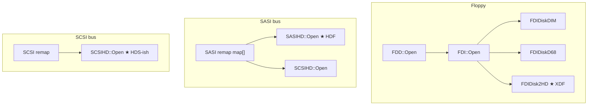
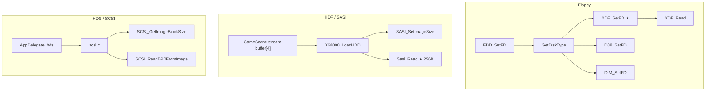

# HDF / HDS / XDF 入口関数マップ（参照専用）

> **目的**: XM6 2.06 と MPX68K から、各イメージ形式の **オープン／読み取り入口** を洗い出す。  
> **禁止**: ここからコードを移植・コピーしない。仕様・オフセット・判定条件の抽出のみ。  
> **日付**: 2026-07-18  
> **根拠**: codebase-memory インデックス + ソース精読  
> **注意**: 参照ソース本体は **本リポジトリに含めない**（ローカル解析用）。

codebase-memory プロジェクト名（ローカル index 時）:

| ツリー | project |
|--------|---------|
| XM6 | `Users-ring2-Documents-src-x68drv-xm6_206s` |
| MPX68K | `Users-ring2-Documents-src-x68drv-MPX68K` |

---

## 1. 一覧（形式 × エミュ × 入口）

| 形式 | XM6 入口（仕様の核） | MPX68K 入口（仕様の核） | x68drv が取るべき仕様メモ |
|------|----------------------|-------------------------|---------------------------|
| **XDF** | `FDIDisk2HD::Open` | `XDF_SetFD` / `XDF_Read` | サイズ **1,261,568**、セクタ 1024、77cyl×2side×8sec |
| **DIM**（関連） | `FDIDiskDIM::Open` | `DIM_SetFD` | ヘッダあり。v0.1 では XDF の次候補 |
| **HDF (SASI)** | `SASIHD::Open` | `X68000_LoadHDD` + `Sasi_*` + `SASI_SetImageSize` | XM6 は **固定サイズ3種** + **256B/セクタ**。MPX68K はバッファ全体を 256B セクタ数として扱う |
| **HDS (SCSI)** | `SCSIHD::Open` | `scsi.c` の `SCSI_GetImageBlockSize` / `SCSI_ReadBPBFromImage` 等 | XM6 は **512B 整列・サイズ帯**のみ。MPX68K は **`X68SCSI1` / `X68K` パーティション**まで解釈 |

---

## 2. XDF（フロッピー raw 2HD）

### 2.1 XM6 (`xm6_206s`)

```
UI/config
  → mfc_frm / mfc_cmd: m_pFDD->Open(drive, path, …)
    → vm/fdd.cpp  FDD::Open
      → vm/fdi.cpp  FDI::Open   ← 形式の自動試行（拡張子に依存しない）
         1) FDIDiskDIM::Open
         2) FDIDiskD68::CheckDisks / Open
         3) FDIDisk2HD::Open     ★ XDF/2HD raw 相当
         4) FDIDisk2DD / 2HQ / BAD …
```

| 関数 | ファイル | 役割 |
|------|----------|------|
| `FDD::Open` | `vm/fdd.cpp` ~610 | ドライブに FDI を載せる |
| `FDI::Open` | `vm/fdi.cpp` ~3934 | **形式ディスパッチ**（DIM→D68→2HD…） |
| **`FDIDisk2HD::Open`** | `vm/fdi.cpp` ~4791 | **サイズがちょうど `1261568` なら成功**。154 トラック（77×2）生成 |
| `FDIDisk2HD::Seek` 以降 | 同ファイル | CHRN とファイルオフセット対応 |

**判定条件（2HD/XDF）**:

```text
file_size == 1_261_568
// コメント上: 0〜76 シリンダ、77*2 トラック
```

拡張子 `.xdf` 文字列は XM6 本体にほぼ出てこない（**サイズで 2HD raw とみなす**）。

### 2.2 MPX68K

```
Swift UI / winx68k
  → FDD_SetFD(drive, filename, readonly)     // fdd.c / winx68k.cpp
    → GetDiskType(filename)                  // 拡張子: D88/88D → D88, DIM → DIM, それ以外 → XDF
    → XDF_SetFD / D88_SetFD / DIM_SetFD
```

| 関数 | ファイル | 役割 |
|------|----------|------|
| `FDD_SetFD` | `X68000 Shared/px68k/x68k/fdd.c` ~86 | タイプ判定 + 関数テーブル |
| `GetDiskType` | 同 ~50 | **拡張子のみ**（`.xdf` はデフォルト XDF） |
| **`XDF_SetFD`** | `disk_xdf.c` ~33 | `malloc(1261568)` して **先頭から 1261568 バイト読込** |
| **`XDF_Read`** | 同 ~154 | セクタ読取 |
| `XDF_Write` | 同 ~190 | 書込（参照のみ） |

**ジオメトリ（`XDF_Read`）**:

```text
// n == 3 → 1024-byte sector
// r: 1..8, h: 0|1, c: cylinder
pos = ((((c << 1) + h) * 8) + (r - 1)) << 10;
// = track_index * 8 * 1024 + (sector-1) * 1024
// track 0..153  (77 cyl * 2 sides)
// total = 154 * 8 * 1024 = 1_261_568
```

### 2.3 x68drv への含意

- v0.1 の **1232KB 固定**は両実装と一致。  
- XM6 は **拡張子非依存・サイズ一致**、MPX68K は **拡張子優先（非 D88/DIM → XDF）**。  
- セクタアドレッシングは MPX68K の `pos` 式が最も明示的。

---

## 3. HDF（SASI ハードディスク）

### 3.1 XM6

```
config->sasi_file[i] / 既定名 HD%d.HDF (mfc_cfg.cpp)
  → sasihd[i] にパス保存
  → SASI デバイス再構成ループ (sasi.cpp ~877)
    case 1 (SASI HD):
      new SASIHD → SASIHD::Open(sasihd[i])
```

| 関数 | ファイル | 役割 |
|------|----------|------|
| パス設定 | `vm/sasi.cpp` ~399 `sasihd[i].SetPath(config->sasi_file[i])` | 設定からパス |
| 再構成 | `vm/sasi.cpp` ~889–916 | map==1 で SASIHD 生成 |
| **`SASIHD::Open`** | `vm/disk.cpp` ~1878 | **サイズ 3 種のみ許可** |
| `Disk::Open` | `vm/disk.cpp` ~867 | キャッシュ・書込可否・ready |
| `Disk::IsSASI` | 同 ~851 | id == `'SAHD'` |
| 既定ファイル名 | `mfc/mfc_cfg.cpp` ~563 | `HD%d.HDF` |

**`SASIHD::Open` が許すサイズ**（これ以外は失敗）:

| ラベル | サイズ (hex) | サイズ (dec) | blocks (`size >> 8`) |
|--------|--------------|--------------|----------------------|
| 10MB | `0x9f5400` | 10,437,632 | 40,772 |
| 20MB | `0x13c9800` | 20,875,264 | 81,544 |
| 40MB | `0x2793000` | 41,750,528 | 163,088 |

**セクタ**:

```text
disk.size = 8;          // 内部コード: 2^8 = 256 バイト/セクタ
disk.blocks = size >> 8;
```

→ XM6 にとって `.hdf` は **ヘッダ無し raw イメージで、256 バイトセクタ固定・容量は 10/20/40MB のみ**（少なくとも 2.06s の `SASIHD`）。

UI からの MO オープン `SASI::Open` は **MO 経路**（`sasi.mo->Open`）であり、固定 HDF 本体の入口ではない。

### 3.2 MPX68K

```
GameScene / FileSystem (Swift)
  → streamDiskImageToBuffer(url, bufferDrive: 4)   // メモリに全載せ
  → X68000_SetStorageBusMode(0)                    // SASI バス（.hdf 時）
  → X68000_LoadHDD(path)                           // winx68k.cpp
       → Config.HDImage[0..15] = path
       → SASI_SetImageSize(i, size)  for i in 0..4
  ゲスト SASI I/O
  → Sasi_Open / Sasi_Read / Sasi_Seek / Sasi_Write  // sasi.c（バッファ[4]）
```

| 関数 | ファイル | 役割 |
|------|----------|------|
| `isValidDiskImageFile` | `FileSystem.swift` ~1206 | 拡張子 `dim,xdf,d88,hdm,hdf`（**hds はここには無い**） |
| HDD ロード分岐 | `GameScene.swift` ~350–370 | `.hdf` → SASI バス + `X68000_LoadHDD` |
| **`X68000_LoadHDD`** | `winx68k.cpp` ~1416 | パス登録 + サイズ通知 |
| **`Sasi_Open/Read/Seek`** | `sasi.c` ~82–139 | 実体は `s_disk_image_buffer[4]` 上の memcpy |
| **`SASI_SetImageSize`** | `sasi.c` ~146 | 容量 |
| `SASI_GetSectorCount` | 同 ~157 | **`size / 256`** |

MPX68K の SASI 側は **XM6 のような 10/20/40 固定サイズ制限は無い**（バッファサイズ依存）。セクタは **256B** で XM6 と一致。

### 3.3 x68drv への含意

- コミュニティの「任意サイズ HDF」と XM6 の **3 サイズ制限**は乖離し得る → **G-HDF-a/b** と実 `disk/*.hdf` + 両ソース照合が必要。  
- 少なくとも両実装は **SASI = 256 バイトセクタ raw（またはそれに近い）** という点で揃う。  
- パーティション表は SASI 経路ではエミュが **ファイル内レイアウトを深くパースしない**（OS が読む）。ホスト側 mount には Human68k パーティション検出が別途必要。

---

## 4. HDS（SCSI ハードディスク）

### 4.1 XM6

```
config->sxsi_file / scsihd[]
  → SCSI 再構成 (scsi.cpp ~3902)
    new SCSIHD → SCSIHD::Open(scsihd[i])
  または SASI map case 2 (sasi.cpp ~918) でも SCSIHD::Open
```

| 関数 | ファイル | 役割 |
|------|----------|------|
| **`SCSIHD::Open`** | `vm/disk.cpp` ~1990 | サイズ制約のみで open |
| `SCSI::Open` | `vm/scsi.cpp` ~4030 | **MO/CD 用**（HDD ではない） |
| 生成 | `scsi.cpp` ~3903, 327, 455 | `new SCSIHD` |

**`SCSIHD::Open` 条件**:

```text
size % 512 == 0
size >= 0x9f5400   // ≥ 約 10MB
size <= 0xfff00000 // ≤ 約 4GB
disk.size = 9;     // 2^9 = 512 バイト/セクタ
disk.blocks = size >> 9;
```

→ XM6 の SCSI HD は **512B セクタ raw としてファイル全体を見せる**。`X68SCSI1` ヘッダの解釈は **この Open には無い**（中身はゲスト OS / 他レイヤ）。

### 4.2 MPX68K（ここが HDS 仕様の宝庫）

```
AppDelegate / GameScene（.hds → SCSI バス）
  → イメージをバッファへ
  → SCSI 側 I/O（scsi.c）
```

| 関数 | ファイル | 役割 |
|------|----------|------|
| `.hds` UI | `AppDelegate.swift` ~300, ~320 | 拡張子 `.hds` で SCSI 経路 |
| **`SCSI_GetPayloadOffset` 系** | `scsi.c` ~1600 | `X68SCSI1` / `68SCSI1` / 説明文字列で **ヘッダ 0x400** |
| **`SCSI_GetImageBlockSize`** | 同 ~1684 | ヘッダの block size または `X68K` パーティション位置で 512/1024 推定 |
| **`SCSI_HasHumanPartitionTable`** | 同 ~1649 | `X68K` + `Human68k` エントリ |
| **`SCSI_ReadBPBFromImage`** | 同 ~3986 | パーティション boot + BPB オフセット `0x12/0x11/0x0E/0x0B`、**BE 風 16bit セクタサイズ** |
| `SCSI_GetIocsDataOffset` | 同 ~1735 | コメント: **IOCS LBA はファイル offset 0 起点**（ヘッダも LBA 空間に含む） |

**コンテナ検出（要約）**:

```text
if buf[0..8) == "X68SCSI1" → header/payload offset 0x400 (2 sectors @ 512)
elif buf[1..8) == "68SCSI1"  → 同様
// partition table: physSectorSize * 4 に "X68K"
// Human68k entry: name "Human68k", start sector BE, boot = start * 1024 (?)
```

`SCSI_HasHumanPartitionTable` 内で boot offset を `startSec * 1024` としている点は、**1024 バイト論理セクタ前提の痕跡**。`SCSI_GetImageBlockSize` と合わせて x68drv の record アドレッシング設計と突合すべき。

### 4.3 x68drv への含意

- **HDS のオンディスク詳細仕様は MPX68K `scsi.c` が XM6 より厚い**。scsitools と並べて読むのが良い。  
- XM6 は「512 整列の巨大ファイル」として扱うだけなので、**ホスト mount には MPX68K / scsitools 側のレイアウト知識が必須**。  
- `.hds` と `.hdf` のバス切替は MPX68K UI 層で明示されている。

---

## 5. 関連: DIM（フロッピー、XDF 隣接）

| 側 | 入口 | メモ |
|----|------|------|
| XM6 | `FDIDiskDIM::Open`（`FDI::Open` の第一候補） | DIM を XDF より先に試す |
| MPX68K | `DIM_SetFD` | ヘッダ `DIM_HEADER` 読込、`SctLength[type]`、`trkflag` |

x68drv v0.1 は XDF 優先だが、ディテクタは **DIM magic を先**（design の magic-first）にすると XM6 と整合。

---

## 6. コールチェーン図

### XM6



### MPX68K



---

## 7. x68drv 実装時の「最初に読む関数」チェックリスト

解析順（移植ではなく精読）:

| 優先 | 形式 | 読め |
|------|------|------|
| 1 | XDF | MPX68K `disk_xdf.c` 全体、XM6 `FDIDisk2HD::Open` |
| 2 | HDF | XM6 `SASIHD::Open`、MPX68K `X68000_LoadHDD` + `SASI_GetSectorCount`、実 `disk/*.hdf` サイズ突合 |
| 3 | HDS | MPX68K `SCSI_GetImageBlockSize` / `SCSI_HasHumanPartitionTable` / `SCSI_ReadBPBFromImage`、scsitools、実 `disk/System.HDS` |
| 4 | DIM | 両 `DIM` Open（v0.1 後） |

---

## 8. 注意（仕様差分）

1. **XM6 HDF は 10/20/40MB のみ**。実イメージがそれ以外なら XM6 では開けないが、MPX68K / DiskExplorer では開ける可能性。  
2. **XM6 SCSIHD は 512B 前提**。SxSI の 1024B record はゲスト側解釈。ホスト FS 実装は MPX68K の方が参考になる。  
3. **拡張子は信頼しすぎない**。XM6 フロッピーはサイズ／マジック試行、MPX68K は拡張子。  
4. 両ツリーとも **参照専用**。関数名・構造はメモに留め、Swift で再実装する。

---

## 9. 実イメージ突合

**正本は別文書に分離した（表・hex・未検証リストを含む）:**

→ **[`disk-samples-verification.md`](disk-samples-verification.md)**（2026-07-18）

要約のみ:

| 形式 | 手元 | 要点 |
|------|------|------|
| XDF | 3 本 | すべて 1232K。Disk1 は BPB 壊れ → 2HD 既定 FO |
| HDF | 2 本 | クラス **`hdf-sasi-x68k-256`**（`X68K`@0x400、phys 256） |
| HDS | 1 本 | `System.HDS` = scsitools モデル一致、ゴールデン主軸 |

索引: [`README.md`](README.md)

---

*Generated for x68drv design; not a license to copy emulator code. 移植禁止。*
