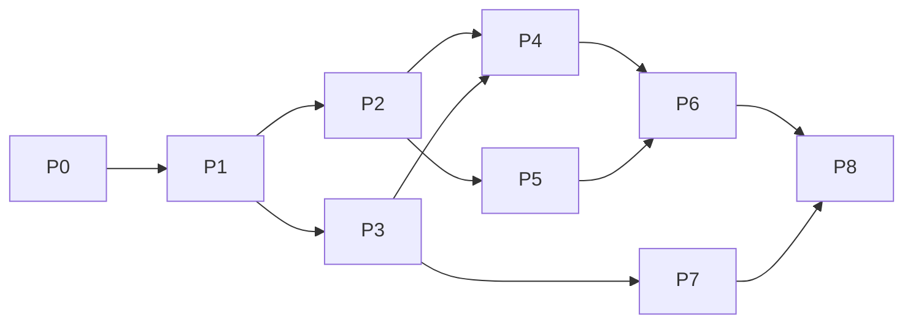

# x68drv 実装プラン & タスクリスト（v0.1）

| 項目 | 内容 |
|------|------|
| 日付 | 2026-07-18 |
| 対象 | **0.1 Finder-mount RO**（書込なし） |
| 規範 | [`design.md`](design.md)（特に Product Requirements / PRD-8） |
| 調査 | [`format-entry-points.md`](format-entry-points.md)、[`disk-samples-verification.md`](disk-samples-verification.md) |

> **原則**: 各フェーズは **テストを書いてから / と同時に** 実装する。フェーズ完了 = そのフェーズの検証チェックリストが全部 green。  
> **禁止**: XM6 / MPX68K からのコード移植。オフセットと条件だけ仕様に落とす。

---

## 0. 全体マップ

```text
Phase 0  リポジトリ / CI 骨格
Phase 1  X68Core 基礎 + 合成フィクスチャ
Phase 2  XDF/DIM 読取（ユニット + 統合）
Phase 3  HDS/SxSI + HDD BE FAT 読取
Phase 4  検出器・export API・fsck(RO)
Phase 5  アプリ殻（Mode A/B・設定・メニューバー）
Phase 6  FUSE RO + Mode C + 取り出す  ★製品の核
Phase 7  HDF 検証クラス + ローカル disk/ 回帰
Phase 8  0.1 受け入れ（PRD-8）+ 配布メモ

（バックログ）書込 / Sparkle / 追加フォーマット
```

### 依存関係（簡略）



### テストの種類（全フェーズ共通）

| 種類 | ツール | いつ |
|------|--------|------|
| **Unit** | XCTest / `swift test` | 各 Core タスクに必須 |
| **Fixture 統合** | 合成イメージで list/read/export | Phase 2–4 |
| **Oracle（任意 CI）** | scsitools / fathuman があれば diff | Phase 4/10 相当 |
| **Local golden** | `disk/`（gitignore・手動 or ローカル only ジョブ） | Phase 7 |
| **UI 手動** | PRD-8 チェックリスト | Phase 5–6, 8 |
| **FUSE 手動** | FUSE-T あり/なし 両マシン | Phase 6, 8 |

**CI 最低ライン**: すべての `swift test` が PR で必須。FUSE / Login Item / Finder は **手動ゲート**（チェックリストに署名）。

---

## Phase 0 — リポジトリ骨格

**ゴール**: ビルド・テストが空でも回る。MIT LICENSE。

### タスク

| ID | タスク | 完了条件 |
|----|--------|----------|
| T0.1 | Xcode プロジェクト or SPM workspace（`X68Core` + 将来 `x68drv` app target） | `swift test` または Xcode test が成功 |
| T0.2 | `LICENSE`（MIT） | ファイル存在 |
| T0.3 | ルート `README.md`（ビルド方法・FUSE-T 前提・docs へのリンク） | 最低限の手順が書ける |
| T0.4 | GitHub Actions: `swift test` on macOS | CI green |
| T0.5 | `.gitignore` 更新（DerivedData, .build, xcuserdata） | 既存 + 追記 |

### テスト

- [x] ローカル `swift test` が pass（Phase 0 実装時点）  
- [x] `xcodebuild -scheme x68drv` が BUILD SUCCEEDED（Phase 0 実装時点）  
- [ ] CI で green（push 後確認）  

### 実装メモ（2026-07-18）

- **`x68drv.xcodeproj`** を最初の成果物として追加（通常 macOS app + local package `X68Core`）
- App 殻: 設定ウィンドウ骨格 + メニューバー + Document Types の Info.plist 骨組み
- 次: Phase 1（endian / path / 合成フィクスチャ）

### 参照

- `design.md` PR-01, KD-1/10/16

---

## Phase 1 — Core 基礎型 + 合成フィクスチャ

**ゴール**: endian / path / encoding / error と、**著作権フリーな合成イメージ**で後続テストの土台。

### タスク

| ID | タスク | 完了条件 |
|----|--------|----------|
| T1.1 | `EndianReader` / `EndianWriter`（BE/LE 16/32） | ✅ |
| T1.2 | `HumanPath`（コンポーネント列、SJIS 安全な 8.3/18.3 分割） | ✅ |
| T1.3 | `cp932` ↔ UTF-8（`String` 変換 + 不能時 escape） | ✅ |
| T1.4 | `X68Error` 列挙（format / fs / io / limit） | ✅ |
| T1.5 | **SyntheticXDF** ファクトリ（フル 1232K LE FAT12） | ✅ size==1261568 |
| T1.6 | **SyntheticHDS** ファクトリ（`X68SCSI1` + `X68K` + BE BPB） | ✅ |

### テスト（必須）

| テスト ID | 内容 | 状態 |
|-----------|------|------|
| U1.endian | 既知バイト列 → BE/LE 数値 | ✅ |
| U1.path | 18.3 パック / アンパック | ✅ |
| U1.enc | `テスト.DAT` の UTF-8 ↔ cp932 | ✅ |
| U1.synth_xdf_size | フル XDF size==1261568 | ✅ |
| U1.synth_hds_magic | `X68SCSI1` / `X68K@0x800` / Human68k | ✅ |
| U1.sjis_split | 8 バイト境界で DBCS を割らない | ✅ |

**Phase 1 完了**（2026-07-18）: `swift test` 15 tests pass。

### 参照

- `design.md` §Human68k directory、KD-8/11  
- `disk-samples-verification.md` §3（2HD 既定）

---

## Phase 2 — XDF / DIM 読取

**ゴール**: フロッピーを list / read / export（ホストへファイル書き出し API）。

### タスク

| ID | タスク | 完了条件 |
|----|--------|----------|
| T2.1 | ImageDetector: DIM magic @0xAB、size hint 1232K | ✅ |
| T2.2 | LE BPB パース + **失敗時 2HD 既定フォールバック** | ✅ |
| T2.3 | FAT12 LE チェーン読取（ループ/上限） | ✅ |
| T2.4 | ルート readdir、ファイル read（subdir もパス対応） | ✅ |
| T2.5 | `export(path, to: URL)` ホストへ書き出し | ✅ |
| T2.6 | 非 1232K XDF は明確エラー | ✅ |

### テスト（必須）

| テスト ID | 内容 | 状態 |
|-----------|------|------|
| U2.detect_xdf | 合成 1232K → kind=xdf | ✅ |
| U2.detect_dim | 合成 DIM → offset=256 | ✅ |
| U2.list_synth | `HELLO.TXT` 一覧 | ✅ |
| U2.read_synth | 内容一致 | ✅ |
| U2.export_synth | export バイト一致 | ✅ |
| U2.fallback_bpb | BPB 壊れ + 2HD FO | ✅ |
| U2.reject_size | size≠1232K | ✅ |
| U2.fat_cycle | 循環 FAT | ✅ |
| I2.local_osr2 | `disk/OSR2.xdf`（あれば） | ✅ ローカル pass |

**Phase 2 完了**（2026-07-18）: `FloppyVolume` + detector。`swift test` 24 tests pass。

### 参照

- `format-entry-points.md` XDF  
- `disk-samples-verification.md` §3  


---

## Phase 3 — HDS / SxSI + HDD ボリューム

**ゴール**: HDS のパーティション列挙と BE FAT16 読取。

### タスク

| ID | タスク | 完了条件 |
|----|--------|----------|
| T3.1 | `X68SCSI1` ヘッダ解析（block size フィールド等） | |
| T3.2 | `X68K` @ LBA4×phys（512 既定）パーティション表 | start/count BE |
| T3.3 | boot = start × **1024**（record）で BPB | System.HDS と整合 |
| T3.4 | BE BPB @ boot+0x12、media 0xF7 系 | |
| T3.5 | FAT16 BE チェーン + readdir/read/export | |
| T3.6 | 複数パーティション列挙 API | 既定 index 0 |

### テスト（必須）

| テスト ID | 内容 |
|-----------|------|
| U3.header | 合成 HDS: magic / X68K@0x800 |
| U3.part0 | start=32 → boot@0x8000 の合成 |
| U3.list_be | 合成上の SJIS 名ファイル list |
| U3.read_export | export バイト一致 |
| U3.multi_part | 2 パーティション合成で index 0/1 |
| I3.local_system_hds | **任意・ローカル**: `disk/System.HDS` list が空でない / 既知名があれば一致 |
| U3.wrong_endian | LE として読まない（意図的壊テスト） |

### 参照

- `design.md` HDS record addressing  
- `disk-samples-verification.md` §5  

---

## Phase 4 — 統合検出・export CLI 相当・fsck(RO)

**ゴール**: アプリ/マウントが使う単一 API。読取専用整合チェック。

### タスク

| ID | タスク | 完了条件 |
|----|--------|----------|
| T4.1 | `DiskImage.open(url) -> MountableVolume...` 統合 API | XDF/HDS/DIM |
| T4.2 | magic-first 検出（design フローチャート） | |
| T4.3 | `export` / `list` の安定 Swift API | |
| T4.4 | fsck(RO): FAT ループ、クロスリンク、size 矛盾 | レポート struct |
| T4.5 | （任意）開発用 `x68drv-tool list/export` | テスト容易性 |
| T4.6 | （任意）oracle スクリプト: scsitools 出力と比較 | CI skip if missing |

### テスト（必須）

| テスト ID | 内容 |
|-----------|------|
| U4.open_matrix | 合成 XDF/HDS/DIM を open |
| U4.fsck_clean | 正常合成 → ok |
| U4.fsck_dirty | 壊した FAT → issues 非空 |
| U4.unknown | ランダムバイト → unknown、マウント不可 |
| I4.oracle | ツールがあれば list 比較（skip 可） |

---

## Phase 5 — アプリ殻（Mode A / B）

**ゴール**: 通常 GUI、設定、メニューバー、Login Item。**まだマウントしなくてよい**（「イメージを開く」は後で接続）。

### タスク

| ID | タスク | 完了条件 |
|----|--------|----------|
| T5.1 | Xcode app target `x68drv`（非 LSUIElement） | ビルド成功 |
| T5.2 | `LaunchRouter`（A/B/C 判定の骨格。C は stub） | ユニット or 軽いロジックテスト |
| T5.3 | 設定ウィンドウ: バージョン + ログイン時起動 + OK | |
| T5.4 | `SMAppService` ログイン項目 | トグルが状態を反映 |
| T5.5 | メニューバー: 設定… / 終了 / プレースホルダ | |
| T5.6 | Document Types を Info.plist に登録（open は log のみ可） | |
| T5.7 | 単一インスタンス（2 重起動しない） | |

### テスト

| テスト ID | 内容 | 種別 |
|-----------|------|------|
| U5.launch_mode | 入力フラグ → Mode A/B/C の分岐表 | Unit（LaunchRouter） |
| M5.mode_a | .app 起動 → 設定が出る → OK → アプリ生存 → メニューから終了 | **手動** |
| M5.mode_b | ログイン項目 ON → 再ログイン → 設定が出ない・メニューバーのみ | **手動** |
| M5.settings_ok | OK で終了しない | **手動** |
| M5.login_toggle | トグルが System Settings と矛盾しない | **手動** |

### 参照

- `design.md` PRD-1〜4, 7 / KD-20,22,23  

---

## Phase 6 — FUSE RO + Mode C + 取り出す ★

**ゴール**: Finder ダブルクリックでマウント、D&D コピー、取り出す。**0.1 の核。**

### タスク

| ID | タスク | 完了条件 |
|----|--------|----------|
| T6.1 | `x68mount-helper`（RO FUSE-T）: readdir/read/getattr | |
| T6.2 | `MountService`: マウントポイント命名・上限 8・状態一覧 | |
| T6.3 | Mode C: document open → mount → `NSWorkspace.open` | |
| T6.4 | メニュー: マウント中 / Finder で表示 / **取り出す** / すべて取り出す | |
| T6.5 | FUSE 未導入検出 → アラート + リンク（偽マウントしない） | |
| T6.6 | 書き込み FUSE op は EROFS / 拒否 | |
| T6.7 | （推奨）緊急 FO: アプリ内 list + export | |
| T6.8 | 同一パス再 open → remount せず Finder 前面 | |

### テスト

| テスト ID | 内容 | 種別 |
|-----------|------|------|
| U6.mount_point | 命名・衝突時 suffix | Unit |
| U6.ro_policy | write 系がエラーになる（ヘルパのユニット or 統合） | Unit |
| I6.fuse_xdf | 合成 or ローカル XDF を helper で mount → `ls` 一致 | 統合（FUSE 要） |
| I6.fuse_hds | 同上 HDS | 統合（FUSE 要） |
| M6.prd8_3 | `OSR2.xdf` ダブルクリック → Finder → D&D コピー | **手動 PRD-8** |
| M6.prd8_4 | 取り出す → 消える | **手動** |
| M6.prd8_5 | `System.HDS` マウント | **手動** |
| M6.prd8_6 | FUSE 無し → 明確エラー | **手動** |
| M6.multi | 2 イメージ同時マウント | **手動** |
| M6.eject_finder | Finder 取り出しとメニュー同期 | **手動** |

### 参照

- `design.md` PRD-5,6,8 / PR-12  

---

## Phase 7 — HDF（`hdf-sasi-x68k-256`）

**ゴール**: 検証済み SASI クラスのみマウント成功。

### タスク

| ID | タスク | 完了条件 |
|----|--------|----------|
| T7.1 | 検出: 非 X68SCSI1 + `X68K`@0x400 + 物理 256 | |
| T7.2 | start×256 → boot、BE BPB | |
| T7.3 | 既知サイズ（10/20/40MB）ヒント（XM6 互換）+ それ以外は警告付き試行 or 拒否ポリシーを実装で固定 | design に合わせて文書化 |
| T7.4 | 未知クラス → マウント失敗メッセージ | |
| T7.5 | Mode C / メニューから HDF も同様 | |

### テスト

| テスト ID | 内容 | 種別 |
|-----------|------|------|
| U7.detect_class | 合成 hdf-sasi-x68k-256 | Unit |
| U7.part_boot | start=33 → 0x2100 | Unit |
| U7.unknown | ランダム巨大ファイル → 非マウント | Unit |
| I7.local_hd | **任意**: `disk/HD.hdf` list | ローカル |
| M7.mount_hd | HD.hdf を Finder で開く | **手動** |

### 参照

- `disk-samples-verification.md` §4  

---

## Phase 8 — 0.1 受け入れ & 配布

**ゴール**: PRD-8 全項目 + リリースノート。

### タスク

| ID | タスク | 完了条件 |
|----|--------|----------|
| T8.1 | PRD-8 チェックリストを埋める（下表） | 全 PASS |
| T8.2 | README: インストール、FUSE-T、対応拡張子、制限（RO） | |
| T8.3 | 公証 / 公証メモ（Developer ID） | 手順文書 |
| T8.4 | 既知の制限リスト（非1232K、未知 HDF、書込不可） | |
| T8.5 | タグ `v0.1.0` | |

### 受け入れチェックリスト（PRD-8）— 手動署名用

| # | シナリオ | PASS |
|---|----------|------|
| 1 | Applications 起動 → 設定 → バージョン → OK 後もメニューバー → 終了可 | ☐ |
| 2 | ログイン時起動 ON → 再ログイン → ウィンドウなし・メニューバーのみ | ☐ |
| 3 | `OSR2.xdf`（または合成）ダブルクリック → マウント → Finder → D&D コピー | ☐ |
| 4 | 取り出す → ボリューム消える | ☐ |
| 5 | `System.HDS`（または合成 HDS）RO マウント | ☐ |
| 6 | FUSE-T 無し → 明確エラー + 導入案内 | ☐ |
| 7 | （推奨）`HD.hdf` 検証クラス マウント | ☐ |
| 8 | イメージへ Finder で書き込みできない（RO） | ☐ |
| 9 | `swift test` / CI green | ☐ |

---

## バックログ（0.1 後・タスク化のみ）

| ID | 内容 | テスト方針 |
|----|------|------------|
| B1 | CLI/メニューからの inject 書込 | 合成 round-trip + fsck + 必須 backup |
| B2 | FUSE 実験的書込 | クラッシュ注入・Finder rename |
| B3 | 非 1232K フロッピー | ジオメトリ表 + テスト行列 |
| B4 | HDF 他クラス | ゴールデン追加後のみ enable |
| B5 | Sparkle 自動更新 | 署名更新フロー |

---

## 推奨リポジトリ構成（実装時）

```text
x68drv/
  Package.swift          # or X68Core as local package
  Sources/
    X68Core/             # ライブラリ
    x68mount-helper/     # FUSE ヘルパ
  Tests/
    X68CoreTests/        # ユニット + フィクスチャ
    Fixtures/            # 生成物 or 生成コード
  Apps/
    x68drv/              # macOS app
  docs/                  # 既存
  .github/workflows/test.yml
  LICENSE
  README.md
```

---

## 作業の進め方（エージェント / 人間）

1. **1 フェーズ = 1 まとまりの PR**（または論理コミット列）  
2. フェーズ開始時にそのフェーズの **失敗するテストを先に追加**（TDD 推奨）  
3. 完了時に上のチェックリストを更新  
4. ローカル `disk/` は CI に載せない。開発者マシンでの I* テストは任意  

### 最初のスプリント提案（最短で価値）

| 順序 | フェーズ | 理由 |
|------|----------|------|
| 1 | Phase 0–2 | XDF が読める = コアの証明 |
| 2 | Phase 3–4 | HDS + 統合 API |
| 3 | Phase 5–6 | Finder 体験（製品） |
| 4 | Phase 7–8 | HDF + 出荷 |

---

## タスク ID 索引（フラット）

| ID | Phase | 要約 |
|----|-------|------|
| T0.1–T0.5 | 0 | 骨格・CI・LICENSE |
| T1.1–T1.6 | 1 | endian/path/enc/synth |
| T2.1–T2.6 | 2 | XDF/DIM 読取 |
| T3.1–T3.6 | 3 | HDS 読取 |
| T4.1–T4.6 | 4 | 統合 API・fsck |
| T5.1–T5.7 | 5 | アプリ殻 Mode A/B |
| T6.1–T6.8 | 6 | FUSE・Mode C・取り出す |
| T7.1–T7.5 | 7 | HDF クラス |
| T8.1–T8.5 | 8 | 受け入れ・配布 |
| B1–B5 | 後 | 書込・拡張 |

テスト ID: `U*` ユニット、`I*` 統合/ローカル、`M*` 手動 UI。

---

*Normative product behavior remains in design.md; this file is the execution checklist.*
